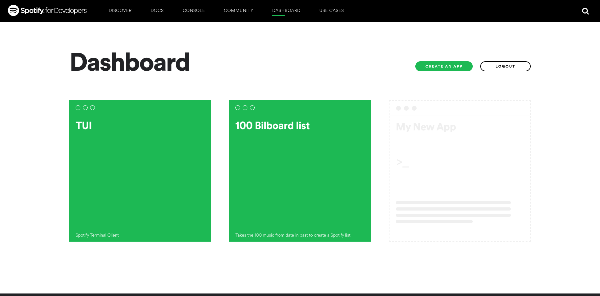
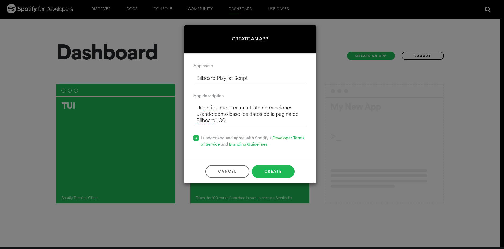
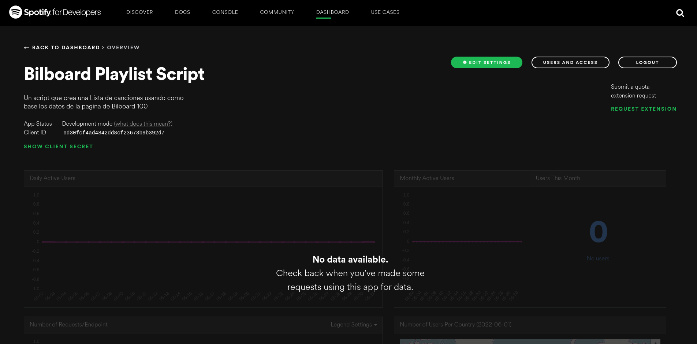
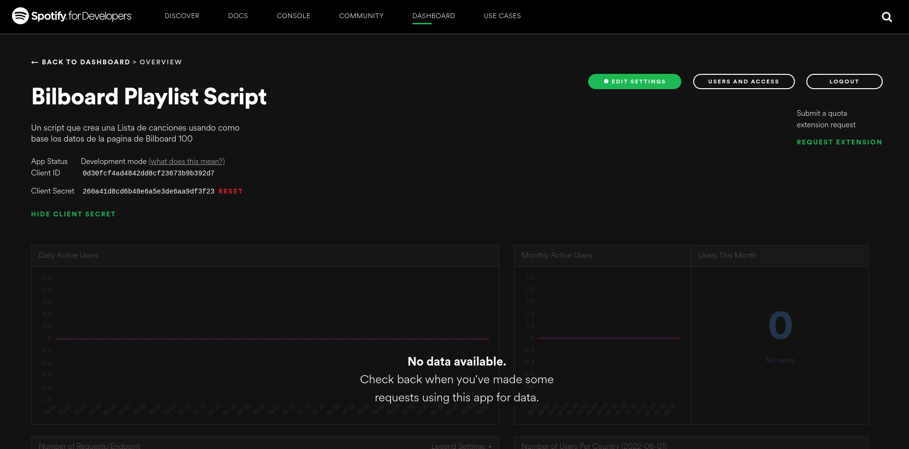
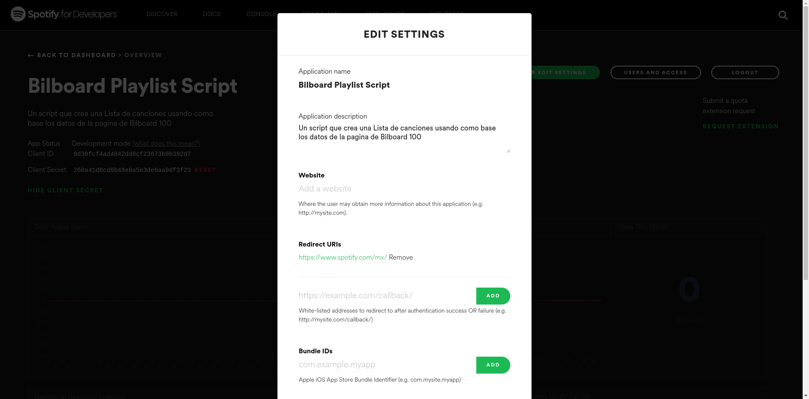
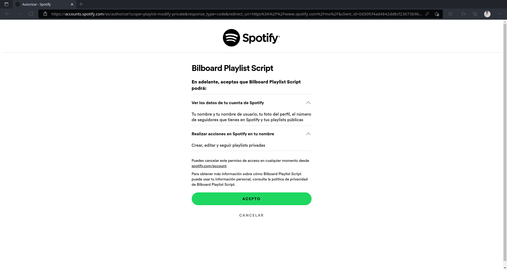
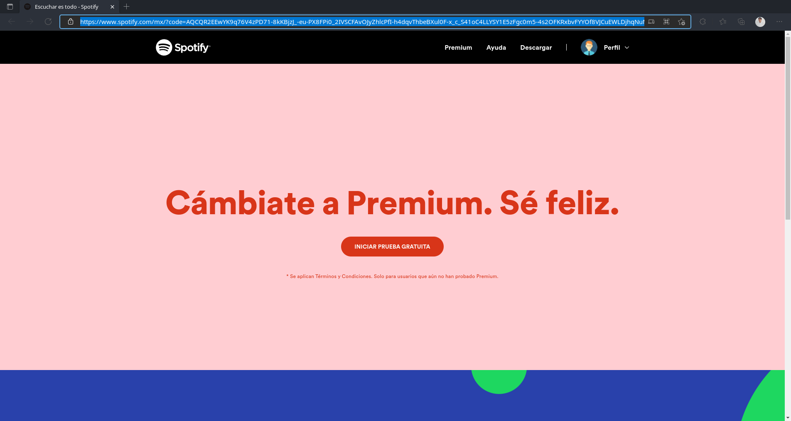
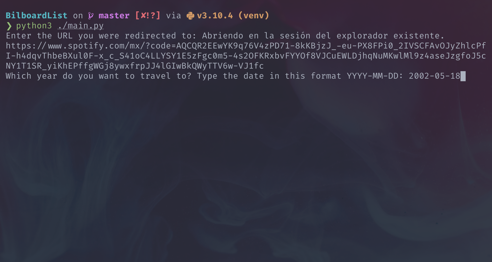
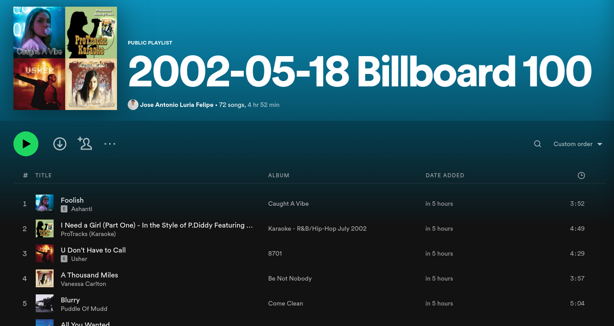

# 🤖 The 100 Bilboard List in Spotify

Un script que crea una lista de Spotify con las 100 canciones más populares de la lista de [Bilboard](https://www.billboard.com/charts/hot-100/)usando como parámetro una fecha dada.

## 🚀 ¿Como usar?

### 1. Clona el proyecto e instala las dependencias

#### Clona el repositorio

Primero debes clonar el repositorio usando Github

```commandline
git clone https://github.com/JoseLuria/python-bilboard-list.git
```

#### Entra al repositorio y crea un entorno virtual

Después debes entrar a la carpeta del repositorio y crear un entorno virtual en donde estarán instaladas las dependencias para que el script funcione, el comando para crear el entorno virtual puede variar dependiendo del sistema operativo, puedes obtener más información sobre como crear el entorno virtual en la [documentación oficial](https://docs.python.org/es/3/library/venv.html)

Entra a la carpeta del repositorio

```commandline
cd python-bilboard-list/
```

En el ejemplo estoy usando el comando para sistemas basados en UNIX (Mac Os y Linux)

```commandline
python3 -m venv venv
```

#### Activa el entorno virtual

El comando para crear el entorno virtual puede variar dependiendo de la shell que uses, de igual manera puedes encontrar más información sobre como activar el entorno virtual en la [documentación oficial](https://docs.python.org/es/3/library/venv.html)

En el ejemplo estoy usando el comando para la shell de bash/zsh

```commandline
source venv/bin/activate
```

Puedes desactivar el entorno virtual usando la palabra deactivate

```commandline
deactivate
```

#### Instala las dependencias usando pip

Lo último que queda es instalar las dependencias necesarias usando el comando pip install con el parámetro -r de read(leer) y señalando el archivo que queremos que lea, en este caso será el archivo requirements.txt en donde se encuentra la lista de dependencias necesarias con sus respectivas versiones

```commandline
pip install -r requirements.txt
```

### 2. Conecta la aplicación con Spotify

Ahora es necesario conectar nuestro script con Spotify para que este pueda hacer uso de la API de Spotify , para eso debes dirigirte al siguiente link e iniciar session con tu cuenta de Spotify:

```text
https://developer.spotify.com/dashboard/applications
```

Deberías de encontrarte con una página similar a esta



Debes dar clic en el botón que dice "CREATE AN APP" e ingresar los datos que te piden, así como aceptar los términos de Spotify,una vez finalizado das clic en el botón de "CREATE" para crear tu APP



Tras haber creado la aplicación deberías de ser redirigido a una página como la siguiente



Al dar clic en el botón de "SHOW CLIENT SECRET" deberías de poder ver un párrafo que contiene el client secret. Lo siguiente que debes de hacer es copiar el client ID y el cliente secret



Dentro del repositorio debes crear un archivo .env en donde tienes que agregar el client ID y el client secret, el archivo .env.example tiene un ejemplo de como debería de quedar el archivo final, pero más o menos sería algo asi:

```text
SECRET_ID=0d30fcf4ad4842dd8cf23673b9b392d7
SECRET_CLIENT=260a41d8cd6b48e6a5e3de6aa9df3f23
```

Lo último que debes hacer es dar clic en el botón de "EDIT SETTINGS" una vez ahí en la sección de Redirect URIs debes agregar la siguiente URL:

```text
https://www.spotify.com/mx/
```

El resultado final debería quedar así



Solo basta con guardar los cambios y con eso el script ya está conectado a Spotify

### 3. Iniciando sesión en Spotify

Lo único que queda por hacer es correr el script e iniciar sesión con una cuenta de Spotify

```commandline
python3 ./main.py
```

El script me redirigirá a la página de inicio de sesión de Spotify y una vez iniciada la sesión, el script pedirá autorizar permisos para que el script acceda a la información de la cuenta



Una vez que realizamos la autenticación se nos redirige a la página de Spotify, ahí debemos de copiar el link de la página y pegarlo en la consola



Ahora el script nos pedirá que ingresemos una fecha iniciando por el año, seguido del mes y después el día el script ira a la página de [Bilboard](https://www.billboard.com/charts/hot-100/) y buscara las 100 canciones más populares en la fecha que ingresaste, una vez realizado creara una lista de Spotify con dichas canciones



El script te mostrara una lista con las canciones que no hayan podido ser encontradas en Spotify, de igual manera se creara un archivo llamado songs.json que incluirá el nombre de la canción, el nombre del artista y el uri de Spotify en caso de que la canción no este en Spotify el uri será igual a null

El archivo songs.json debería verse así

```json
[
  {
    "song": "Foolish",
    "artist": "Ashanti",
    "uri": "spotify:track:0b4EIR3qU7yWDe06MlKllP"
  },
  {
    "song": "What's Luv?",
    "artist": "Fat Joe Featuring Ashanti",
    "uri": null
  },
  {
    "song": "I Need A Girl (Part One)",
    "artist": "P. Diddy Featuring Usher & Loon",
    "uri": "spotify:track:2DvmgYV2lrKpUKFGMuSe8b"
  }
]
```

La lista de Spotify debería verse así



## ⚙️️ Esta aplicación fue construida usando las siguientes tecnologías

- [Python](https://www.python.org/)
- [Requests](https://pypi.org/project/requests/)
- [Spotipy](https://pypi.org/project/spotipy/)
- [Beautiful Soup](https://pypi.org/project/beautifulsoup4/)

## 📄 Licencia

[MIT](https://opensource.org/licenses/MIT)
